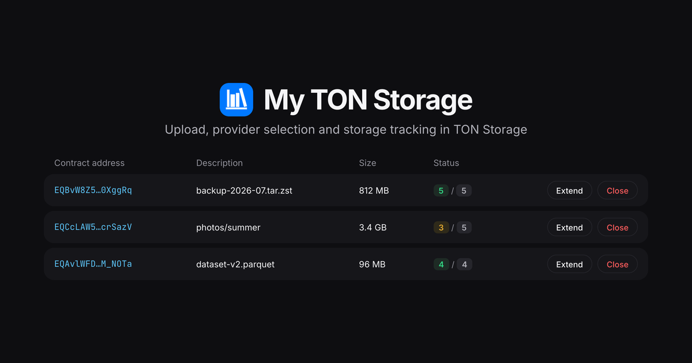

# 💎 My TON Storage

[](LICENSE)
[](https://www.typescriptlang.org/)
[](https://react.dev/)
[](https://www.docker.com/)



**My TON Storage** is a web app for storing files in TON Storage. Upload files or a whole folder, pick the
providers that will keep them, choose how long storage is paid for, and deploy the storage contract from your
wallet — then watch every contract's proof status on the second tab. Theme and language are remembered by the
browser.

## Usage

Requires Node 22 and pnpm 11.

1. Install dependencies:

   ```bash
   pnpm install
   ```

2. Start the dev server:

   ```bash
   pnpm dev
   ```

The app starts on `:5173`. The services it talks to sit on other origins, so the dev server proxies them:
`/api` reaches the mytonstorage backend, `/mtpo` the provider catalog and `/toncenter` the toncenter API.
Point the client at those paths in `.env.local`, otherwise it calls the absolute URLs and the browser blocks
them:

```
VITE_API_URL=
VITE_MTPO_URL=/mtpo
VITE_TONCENTER_URL=/toncenter
```

TON Connect ties the wallet proof to the origin named in the wallet manifest, and the backend validates that
origin against its own `SYSTEM_HOST`. To sign in against the production backend, advertise its manifest:

```
VITE_TONCONNECT_MANIFEST_URL=https://mytonstorage.org/tonconnect-manifest.json
```

To work against a backend of your own, serve the app, `/api` and `/tonconnect-manifest.json` from one HTTPS
origin — expose the dev server through a tunnel, for example `cloudflared tunnel --url http://localhost:5173`,
and name that host in the backend's `SYSTEM_HOST`. `BACKEND_PROXY_TARGET`, `CATALOG_PROXY_TARGET` and
`TONCENTER_PROXY_TARGET` override where the dev proxy forwards.

### Production build

```bash
pnpm build
```

The app is built into static files in `dist/`, served by any static host. To check the result locally:

```bash
pnpm preview
```

Unit tests cover `src/lib`:

```bash
pnpm test
```

Five build-time variables are baked into the bundle. For the three service URLs an empty value means the app
calls its own origin; `VITE_SITE_URL` has to name the origin the app is served from, because the wallet
manifest is written at build time and cannot fall back to it:

| Variable                       | Description                                              | Default                     |
|--------------------------------|----------------------------------------------------------|-----------------------------|
| `VITE_API_URL`                 | Base URL of the mytonstorage backend                     | `https://mytonstorage.org`  |
| `VITE_MTPO_URL`                | Base URL serving the provider catalog and checks         | `https://mytonprovider.org` |
| `VITE_TONCENTER_URL`           | Base URL of the toncenter API                            | `https://toncenter.com`     |
| `VITE_SITE_URL`                | Origin the app is served from, for manifest and previews | `https://mytonstorage.org`  |
| `VITE_TONCONNECT_MANIFEST_URL` | Manifest to advertise when not served from this origin   | built from `VITE_SITE_URL`  |

To build for another origin:

```bash
VITE_API_URL=https://example.com \
VITE_SITE_URL=https://example.com \
pnpm build
```

## Docker

To run a self-hosted instance (behind your own reverse proxy, for example) without installing Node:

```bash
docker compose up -d --build
```

The app is served on `${PORT}`, which falls back to `:8080`. Copy `.env.example` to `.env` and set `PORT`,
`VITE_API_URL`, `VITE_SITE_URL` and `VITE_TONCONNECT_MANIFEST_URL` there — compose reads `.env` on its own.
The catalog and toncenter keep their built-in defaults: the image leaves those two variables undefined, so
an empty value cannot turn them into same-origin calls.

By default the container is plain static hosting: it answers with the app and nothing else, so `/api` has
to be served on the same origin by the proxy in front of it.

An instance that has no backend of its own can borrow the production one. `staging.conf` proxies `/api`
to `https://mytonstorage.org`, and a second compose file mounts it into nginx:

```bash
docker compose -f compose.yaml -f compose.staging.yaml up -d --build
```

Point `VITE_TONCONNECT_MANIFEST_URL` at the production manifest in that setup: the backend only accepts
a ton-proof signed for its own domain.

To only build the static files without Node or a running container:

```bash
docker build --target dist --output dist .
```

## Deployment

Every push to `master`, and every pull request, runs lint, tests and build in CI.

Deployment is self-hosted: pull `master` on the host and rebuild the container as shown in
[Docker](#docker).

Static hosting on a separate domain — GitHub Pages included — does not work for this app. The backend
sets its session cookie `SameSite=Strict`, serves no CORS headers, and ton-proof only accepts a signature
whose domain matches the backend host, so the app has to answer on the same origin as `/api` and the
wallet manifest.

## License

This repository is distributed under the [Apache License 2.0](LICENSE).
